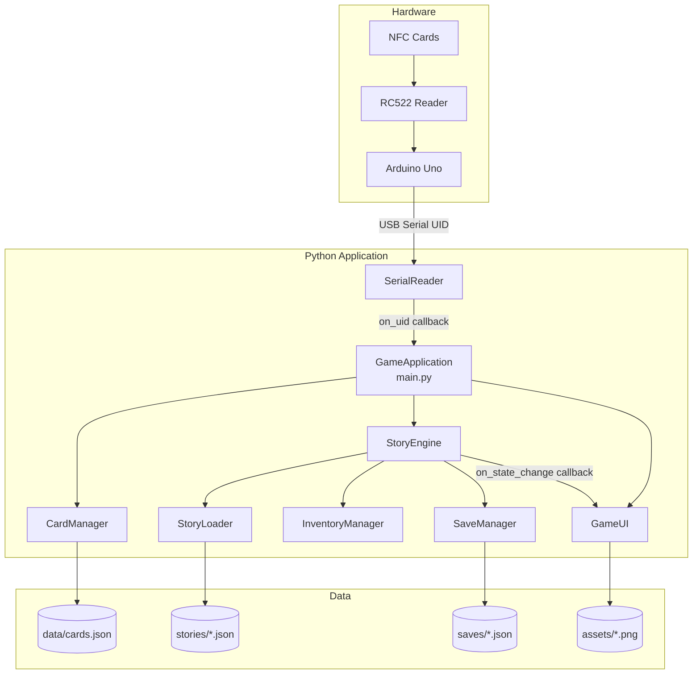
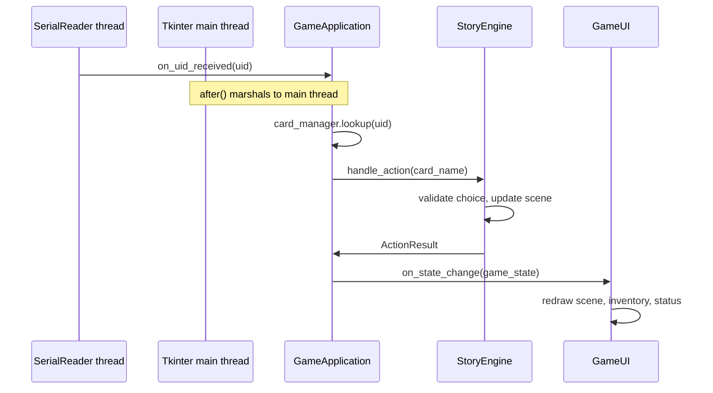
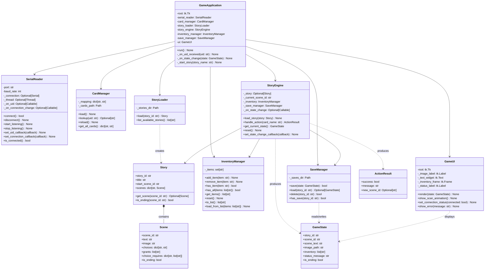
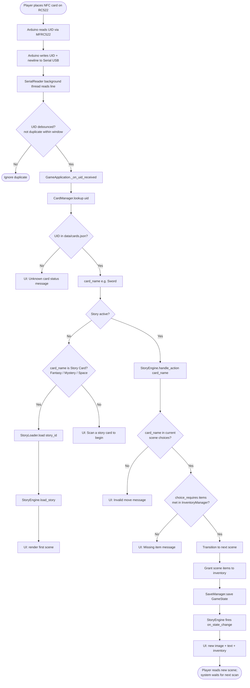

# Architecture — Tangible NFC Interactive Storytelling Game

**Course:** Natural User Interfaces (NUI)  
**Version:** Step 2 — Architecture Design  
**Status:** Design complete; implementation not started

---

## 1. Overview

This project is an **offline, tangible-interaction storytelling game**. Players advance a branching narrative by scanning **physical NFC cards** on an Arduino RC522 reader — not by clicking GUI buttons. Python receives card UIDs over USB serial, maps them to symbolic card names, and drives a story state machine that updates a Tkinter display.

### Design goals

| Goal | Approach |
|------|----------|
| Tangible NUI | NFC cards are the sole gameplay input; GUI is display-only |
| Offline operation | Predefined JSON stories and local assets; no network or AI |
| Scalability | New stories and cards added via JSON files without changing engine code |
| Maintainability | Single-responsibility modules, dependency injection, callback-based events |
| OOP / SOLID | Interfaces between layers; core engine independent of Tkinter and PySerial |

### High-level component diagram



---

## 2. File & Folder Responsibilities

### Root Python modules

| File | Step | Responsibility |
|------|------|----------------|
| `main.py` | 2 | **Composition root.** Instantiates all modules, wires callbacks, starts the Tkinter event loop, and owns application lifecycle (startup, shutdown, serial reconnect). Contains `GameApplication` class only — no business logic. |
| `serial_reader.py` | 3 | **Hardware I/O boundary.** Opens the Arduino serial port via PySerial, reads UID lines in a background thread, debounces duplicate scans, and invokes a registered callback. Handles disconnect detection and automatic reconnect. |
| `card_manager.py` | 5 | **UID → card mapping.** Loads `data/cards.json` at startup and provides lookup of a raw UID string to a structured card object (e.g. `"3AF12491"` → `Card(name="Sword", type=action)`). Unknown UIDs return `UnknownCard`. |
| `story_loader.py` | 4 | **Story data ingestion.** Reads and validates JSON story files from `stories/`, parses them into immutable domain objects (`Story`, `Scene`), and raises structured errors for malformed files. |
| `story_engine.py` | 4 | **Core game logic.** Tracks the active story, current scene, and ending state. Accepts card-name actions, validates choices against the current scene, consults `InventoryManager` for item-gated paths, transitions scenes, and notifies listeners of state changes. |
| `inventory_manager.py` | 4 *(planned)* | **Player inventory.** Maintains the set of items collected during a play session (e.g. `"Key"`, `"Shield"`). Supports add, remove, query, and reset. Used by `StoryEngine` for conditional scene transitions. |
| `save_manager.py` | 4 *(planned)* | **Persistence.** Serializes and restores game state (active story, current scene ID, inventory) to/from JSON files under `saves/`. Enables resume-after-close without changing story content. |
| `ui.py` | 5 | **Presentation layer.** Tkinter-based dark-mode GUI: scene image, story text, inventory panel, connection status, and scan animation. **No gameplay buttons.** Updates reactively via callbacks from `StoryEngine` and `SerialReader`. |

### Data & asset directories

| Path | Responsibility |
|------|----------------|
| `arduino/` | Arduino Uno firmware (Step 3). Contains the RC522 sketch using the MFRC522 library. Reads NFC UIDs and writes them as newline-terminated strings over USB serial at 9600 baud. No game logic on the microcontroller. |
| `assets/` | Scene images referenced by story JSON (`"image": "castle.png"`). Organized flat or by story subfolder; paths resolved relative to `assets/`. |
| `stories/` | One JSON file per story (`fantasy.json`, `mystery.json`, `space.json`). Each file defines scenes, choices, optional item grants, and ending markers. Adding a story requires only a new file — no code change. |
| `data/cards.json` | UID-to-card registry. Each key is an uppercase UID; values are objects with `name` and `type` (`story`, `action`, `item`, `system`). Populated once physical cards are enrolled. |
| `saves/` *(planned)* | Auto-created directory for save files written by `SaveManager`. Not tracked in git. |
| `docs/` | Project documentation. This architecture document and future design notes. |
| `requirements.txt` | Python dependencies: `pyserial`, `Pillow`, and pinned versions added during implementation steps. |
| `README.md` | Project overview, setup instructions, and links to documentation. |
| `.gitignore` | Excludes virtual environments, `__pycache__`, and generated save files. |

### Planned module note

`inventory_manager.py` and `save_manager.py` are **documented here as planned modules** for Step 4 implementation. Placeholder files are not required until implementation begins; their interfaces are fully specified in Section 5.

---

## 3. Module Communication

### Interaction patterns

The system uses three complementary patterns to keep layers decoupled:

1. **Dependency injection** — `GameApplication` constructs all objects and passes dependencies into constructors. No module creates its own collaborators via global imports.
2. **Callback / observer events** — asynchronous boundaries (serial I/O, engine state) notify upstream consumers through callables registered at startup.
3. **Immutable data transfer** — `StoryLoader` returns read-only domain objects; modules never mutate shared JSON files at runtime.

### Communication matrix

| From | To | Mechanism | Payload / contract |
|------|----|-----------|-------------------|
| Arduino RC522 | SerialReader | USB serial line (`"<UID>\\n"`) | Raw UID hex string, e.g. `"3AF12491"` |
| SerialReader | GameApplication | `on_uid_received: Callable[[str], None]` | UID string; fired on background thread |
| GameApplication | CardManager | Direct method call | `lookup(uid) -> Optional[str]` |
| CardManager | GameApplication | Return value | Card name or `None` (unknown card) |
| GameApplication | StoryEngine | Direct method call | `handle_action(card_name) -> ActionResult` |
| StoryEngine | InventoryManager | Direct method call (injected) | `has_item()`, `add_item()`, `get_items()` |
| StoryEngine | SaveManager | Direct method call (injected) | `save(state)` after successful transitions |
| StoryLoader | StoryEngine | Constructor injection | `Story` object loaded once per story start |
| StoryEngine | GameUI | `on_state_change: Callable[[GameState], None]` | Full snapshot: scene text, image path, inventory, status message |
| SerialReader | GameUI | `on_connection_change: Callable[[bool], None]` | Connected / disconnected flag |
| GameUI | *(none for gameplay)* | — | Display only; no reverse gameplay events |

### Threading model



**Rule:** All Tkinter updates occur on the main thread. `GameApplication` uses `root.after(0, ...)` to marshal serial callbacks safely.

### Error propagation

| Condition | Detected by | Surfaced via |
|-----------|-------------|--------------|
| Unknown UID | CardManager → `None` | UI status: *"Unknown card"* |
| Invalid choice (card not in current scene choices) | StoryEngine | UI status: *"That action is not available here"* |
| Story file missing / invalid JSON | StoryLoader | Startup error dialog; app refuses to start story |
| Serial disconnect | SerialReader | UI status: *"Reader disconnected — reconnecting…"*; auto-retry |
| Missing image asset | GameUI | Placeholder frame + warning in status bar |

---

## 4. UML Class Diagram



---

## 5. Data Flow Diagram — NFC Scan to Story Change



### Story selection flow (first scan)

Story cards (`"Fantasy"`, `"Mystery"`, `"Space"`) are ordinary entries in `data/cards.json`. When no story is active, scanning a story card triggers `StoryLoader.load()` instead of a scene choice. This keeps the card system uniform — no special-case hardware.

---

## 6. Data Formats

### 6.1 `data/cards.json`

```json
{
  "3AF12491": { "name": "Fantasy", "type": "story" },
  "3AF18811": { "name": "Sword", "type": "action" },
  "4B02A1C3": { "name": "Key", "type": "item" }
}
```

Keys are uppercase-normalized UID strings. Each value is an object with `name` (matches story choice keys or story identifiers) and `type` (`story`, `action`, `item`, or `system`).

### 6.2 Story JSON (`stories/fantasy.json`)

Base format (required fields per original spec):

```json
{
  "id": "fantasy",
  "title": "Fantasy Quest",
  "start_scene": "castle",
  "scenes": {
    "castle": {
      "id": "castle",
      "text": "You enter the castle.",
      "image": "castle.png",
      "choices": {
        "Sword": "dragon",
        "Run": "forest",
        "Magic": "wizard"
      }
    }
  }
}
```

Extended fields (optional, parsed by `StoryLoader` without breaking simple stories):

| Field | Type | Purpose |
|-------|------|---------|
| `"grants"` | `list[str]` | Items added to inventory when entering the scene |
| `"choice_requires"` | `dict[str, list[str]]` | Items required to take a specific choice |
| `"is_ending"` | `bool` | Marks terminal scenes for ending detection |

Example with inventory gating:

```json
{
  "id": "door",
  "text": "A locked door blocks your path.",
  "image": "door.png",
  "choices": {
    "Key": "secret_room",
    "Run": "hallway"
  },
  "choice_requires": {
    "Key": ["Key"]
  }
}
```

### 6.3 Save JSON (`saves/<story_id>.json`)

```json
{
  "story_id": "fantasy",
  "scene_id": "wizard",
  "inventory": ["Key", "Torch"],
  "saved_at": "2026-07-02T21:00:00"
}
```

---

## 7. Class Definitions

> Public methods only. No implementation bodies. Types use Python 3.10+ syntax.

---

### 7.1 `GameApplication` — `main.py`

**Responsibility:** Application composition root. Wires modules, manages lifecycle, marshals thread-safe UI updates.

| Attribute | Type |
|-----------|------|
| `_root` | `tk.Tk` |
| `_serial_reader` | `SerialReader` |
| `_card_manager` | `CardManager` |
| `_story_loader` | `StoryLoader` |
| `_story_engine` | `StoryEngine` |
| `_inventory_manager` | `InventoryManager` |
| `_save_manager` | `SaveManager` |
| `_ui` | `GameUI` |

| Method | Purpose |
|--------|---------|
| `__init__(self, config: AppConfig) -> None` | Construct and wire all modules with injected dependencies. |
| `run(self) -> None` | Start serial listening and enter the Tkinter main loop. |
| `shutdown(self) -> None` | Stop serial thread, persist state, destroy window. |

---

### 7.2 `AppConfig` — `main.py`

**Responsibility:** Immutable startup configuration (paths, serial port, debounce interval).

| Attribute | Type |
|-----------|------|
| `serial_port` | `str` |
| `baud_rate` | `int` |
| `cards_path` | `Path` |
| `stories_dir` | `Path` |
| `assets_dir` | `Path` |
| `saves_dir` | `Path` |
| `debounce_ms` | `int` |

| Method | Purpose |
|--------|---------|
| `from_defaults(cls) -> AppConfig` | Factory using project-relative default paths. |

---

### 7.3 `SerialReader` — `serial_reader.py`

**Responsibility:** PySerial communication with Arduino; asynchronous UID delivery.

| Attribute | Type |
|-----------|------|
| `_port` | `str` |
| `_baud_rate` | `int` |
| `_debounce_ms` | `int` |
| `_connection` | `Optional[serial.Serial]` |
| `_thread` | `Optional[threading.Thread]` |
| `_running` | `bool` |
| `_last_uid` | `Optional[str]` |
| `_last_uid_time` | `float` |
| `_on_uid` | `Optional[Callable[[str], None]]` |
| `_on_connection_change` | `Optional[Callable[[bool], None]]` |

| Method | Purpose |
|--------|---------|
| `__init__(self, port: str, baud_rate: int = 9600, debounce_ms: int = 1500) -> None` | Configure port settings. |
| `connect(self) -> bool` | Open serial port; return success. |
| `disconnect(self) -> None` | Close port and signal disconnected. |
| `start_listening(self) -> None` | Spawn background read loop. |
| `stop_listening(self) -> None` | Stop thread gracefully. |
| `set_uid_callback(self, callback: Callable[[str], None]) -> None` | Register UID handler. |
| `set_connection_callback(self, callback: Callable[[bool], None]) -> None` | Register connect/disconnect handler. |
| `is_connected(self) -> bool` | Report current connection state. |

---

### 7.4 `CardManager` — `card_manager.py`

**Responsibility:** Load and query the UID → card name mapping.

| Attribute | Type |
|-----------|------|
| `_cards_path` | `Path` |
| `_mapping` | `dict[str, str]` |

| Method | Purpose |
|--------|---------|
| `__init__(self, cards_path: Path) -> None` | Store path; call `load()`. |
| `load(self) -> None` | Read and parse `cards.json`. |
| `reload(self) -> None` | Re-read file (supports hot-reload during development). |
| `lookup(self, uid: str) -> Optional[str]` | Return card name for UID, or `None`. |
| `get_all_cards(self) -> dict[str, str]` | Return full mapping copy. |

---

### 7.5 `StoryLoader` — `story_loader.py`

**Responsibility:** Parse story JSON files into domain objects with validation.

| Attribute | Type |
|-----------|------|
| `_stories_dir` | `Path` |

| Method | Purpose |
|--------|---------|
| `__init__(self, stories_dir: Path) -> None` | Set stories directory. |
| `load(self, story_id: str) -> Story` | Load and validate one story file; raise `StoryLoadError` on failure. |
| `list_available_stories(self) -> list[str]` | Return story IDs found in directory. |

---

### 7.6 `Story` — `story_loader.py`

**Responsibility:** Immutable in-memory representation of a complete story graph.

| Attribute | Type |
|-----------|------|
| `story_id` | `str` |
| `title` | `str` |
| `start_scene_id` | `str` |
| `scenes` | `dict[str, Scene]` |

| Method | Purpose |
|--------|---------|
| `get_scene(self, scene_id: str) -> Optional[Scene]` | Retrieve scene by ID. |
| `is_ending(self, scene_id: str) -> bool` | Check whether scene is terminal. |

---

### 7.7 `Scene` — `story_loader.py`

**Responsibility:** Immutable single scene node in the story graph.

| Attribute | Type |
|-----------|------|
| `scene_id` | `str` |
| `text` | `str` |
| `image` | `str` |
| `choices` | `dict[str, str]` |
| `grants` | `list[str]` |
| `choice_requires` | `dict[str, list[str]]` |
| `is_ending` | `bool` |

*(No public methods — pure data object, implemented as `@dataclass(frozen=True)`.)*

---

### 7.8 `StoryEngine` — `story_engine.py`

**Responsibility:** Story state machine. Validates actions, manages transitions, coordinates inventory and saves.

| Attribute | Type |
|-----------|------|
| `_story` | `Optional[Story]` |
| `_current_scene_id` | `str` |
| `_inventory` | `InventoryManager` |
| `_save_manager` | `SaveManager` |
| `_on_state_change` | `Optional[Callable[[GameState], None]]` |

| Method | Purpose |
|--------|---------|
| `__init__(self, inventory: InventoryManager, save_manager: SaveManager) -> None` | Inject dependencies. |
| `load_story(self, story: Story, resume_state: Optional[GameState] = None) -> None` | Activate a story; optionally restore saved position. |
| `handle_action(self, card_name: str) -> ActionResult` | Process a card action; transition scene if valid. |
| `get_current_state(self) -> GameState` | Build current state snapshot for UI. |
| `reset(self) -> None` | Clear active story and inventory. |
| `is_story_active(self) -> bool` | Return whether a story is in progress. |
| `set_state_change_callback(self, callback: Callable[[GameState], None]) -> None` | Register listener for scene changes. |

---

### 7.9 `InventoryManager` — `inventory_manager.py` *(planned)*

**Responsibility:** Track items collected during gameplay for gating and display.

| Attribute | Type |
|-----------|------|
| `_items` | `set[str]` |

| Method | Purpose |
|--------|---------|
| `__init__(self) -> None` | Initialize empty inventory. |
| `add_item(self, item: str) -> None` | Add item if not already held. |
| `remove_item(self, item: str) -> None` | Remove item from inventory. |
| `has_item(self, item: str) -> bool` | Check single item ownership. |
| `has_all(self, items: list[str]) -> bool` | Check all required items present. |
| `get_items(self) -> list[str]` | Return sorted item list for UI display. |
| `reset(self) -> None` | Clear all items (new game). |
| `to_list(self) -> list[str]` | Serialize for save files. |
| `load_from_list(self, items: list[str]) -> None` | Restore from save file. |

---

### 7.10 `SaveManager` — `save_manager.py` *(planned)*

**Responsibility:** Persist and restore `GameState` to JSON files.

| Attribute | Type |
|-----------|------|
| `_saves_dir` | `Path` |

| Method | Purpose |
|--------|---------|
| `__init__(self, saves_dir: Path) -> None` | Ensure saves directory exists. |
| `save(self, state: GameState) -> bool` | Write state to `<story_id>.json`; return success. |
| `load(self, story_id: str) -> Optional[GameState]` | Read saved state or return `None`. |
| `has_save(self, story_id: str) -> bool` | Check if save file exists. |
| `delete(self, story_id: str) -> bool` | Remove save file (new game). |

---

### 7.11 `GameUI` — `ui.py`

**Responsibility:** Tkinter presentation. Dark-mode layout, image rendering via Pillow, scan feedback animation. Display-only for gameplay.

| Attribute | Type |
|-----------|------|
| `_root` | `tk.Tk` |
| `_assets_dir` | `Path` |
| `_image_label` | `tk.Label` |
| `_text_widget` | `tk.Text` |
| `_inventory_frame` | `tk.Frame` |
| `_status_label` | `tk.Label` |
| `_scan_indicator` | `tk.Canvas` |
| `_current_photo` | `Optional[ImageTk.PhotoImage]` |

| Method | Purpose |
|--------|---------|
| `__init__(self, root: tk.Tk, assets_dir: Path) -> None` | Build widget tree and apply dark theme. |
| `render(self, state: GameState) -> None` | Update all panels from a state snapshot. |
| `show_scan_animation(self) -> None` | Brief visual pulse when a card is detected. |
| `set_connection_status(self, connected: bool) -> None` | Show reader connected/disconnected indicator. |
| `show_error(self, message: str) -> None` | Display error in status bar. |

---

### 7.12 `GameState` — `story_engine.py`

**Responsibility:** Immutable snapshot of game state for UI rendering and persistence.

| Attribute | Type |
|-----------|------|
| `story_id` | `str` |
| `scene_id` | `str` |
| `scene_text` | `str` |
| `image_path` | `str` |
| `inventory` | `list[str]` |
| `status_message` | `str` |
| `is_ending` | `bool` |

*(Data object — `@dataclass(frozen=True)`.)*

---

### 7.13 `ActionResult` — `story_engine.py`

**Responsibility:** Outcome of a single `handle_action` call.

| Attribute | Type |
|-----------|------|
| `success` | `bool` |
| `message` | `str` |
| `new_scene_id` | `Optional[str]` |

*(Data object — `@dataclass(frozen=True)`.)*

---

### 7.14 `StoryLoadError` — `story_loader.py`

**Responsibility:** Exception raised when story JSON is missing, malformed, or references invalid scene IDs.

*(Subclasses `Exception`; no additional public API.)*

---

## 8. SOLID Mapping

| Principle | Application |
|-----------|-------------|
| **S** — Single Responsibility | Each module owns one concern: serial I/O, card mapping, story parsing, state logic, inventory, persistence, UI. |
| **O** — Open/Closed | New stories and cards added via JSON only. Engine accepts new choice rules through optional JSON fields, not code edits. |
| **L** — Liskov Substitution | Domain objects (`Story`, `Scene`, `GameState`) are immutable dataclasses; no inheritance hierarchies that could break substitutability. |
| **I** — Interface Segregation | Callbacks are small and specific (`on_uid`, `on_state_change`, `on_connection_change`) rather than one fat observer interface. |
| **D** — Dependency Inversion | `StoryEngine` depends on `InventoryManager` and `SaveManager` abstractions injected at construction; it does not import Tkinter or PySerial. |

---

## 9. Implementation Step Mapping

| Step | Modules / artifacts |
|------|---------------------|
| 1 ✅ | Folder structure |
| 2 ✅ | This architecture document |
| 3 | `arduino/`, `serial_reader.py` |
| 4 | `card_manager.py`, `story_loader.py`, `story_engine.py`, `inventory_manager.py`, `save_manager.py` |
| 5 | `ui.py`, `main.py` |
| 6 | `assets/`, `stories/`, `cards.json` population |
| 7 | Integration testing |

---

## 10. Architecture Review

### Strengths

- **Clear separation of concerns** — Hardware (Arduino), I/O (SerialReader), domain logic (StoryEngine), and presentation (GameUI) are independently testable.
- **Data-driven scalability** — Adding stories, scenes, cards, and inventory rules requires JSON edits only, aligning with the offline predefined-content constraint.
- **Tangible-first design** — Gameplay input is exclusively NFC; the GUI offers no gameplay buttons, preserving NUI authenticity.
- **Thread-safe serial handling** — Explicit main-thread marshalling prevents Tkinter race conditions.
- **Minimal Arduino scope** — Firmware only reads and transmits UIDs, keeping all game rules in Python where they are easier to maintain and test.

### Trade-offs

- **Callback wiring complexity** — `GameApplication` becomes a central hub; acceptable for this project scale but would benefit from a lightweight event bus if features grow significantly.
- **JSON schema evolution** — Optional fields (`grants`, `choice_requires`) extend the base format; malformed optional fields could cause subtle bugs without a JSON schema validator.
- **Single-player, single-session saves** — `SaveManager` stores one file per story; multiplayer or multiple save slots would require schema changes.
- **No automated card enrollment UI** — UIDs must be manually added to `cards.json` during hardware setup; a enrollment mode could be added later.

### Suggested improvements before implementation

1. **Add a JSON Schema file** (`docs/story.schema.json`) to validate story files at load time and catch authoring errors early.
2. **Define a card enrollment mode** — a developer-facing serial monitor command or temporary UI panel that prints unknown UIDs for easy `cards.json` population.
3. **Unit-test StoryEngine in isolation** — mock `InventoryManager` and feed synthetic `Story` objects to verify transitions, gating, and ending detection before hardware integration.
4. **Document serial protocol** — specify exact Arduino output format (uppercase hex, newline delimiter, baud rate) in `arduino/README.md` during Step 3 to lock the hardware/software contract.
5. **Consider `typing.Protocol`** for `SaveManager` and `InventoryManager` if mock implementations are needed in tests, enabling structural subtyping without inheritance.

---

*End of architecture document — Step 2 complete.*
