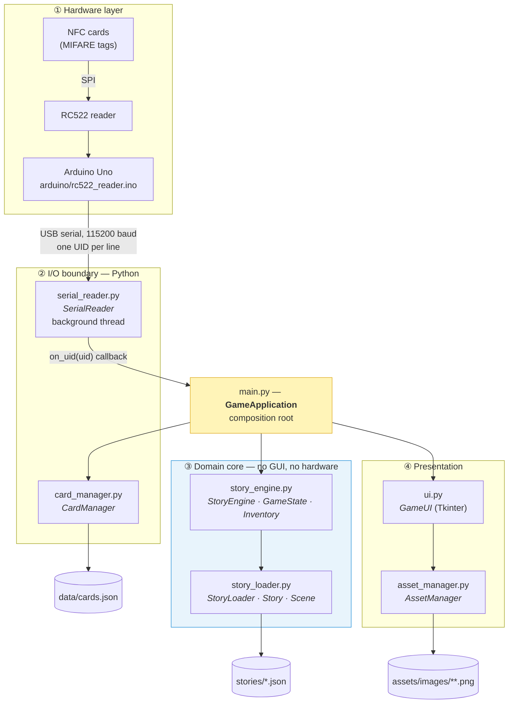
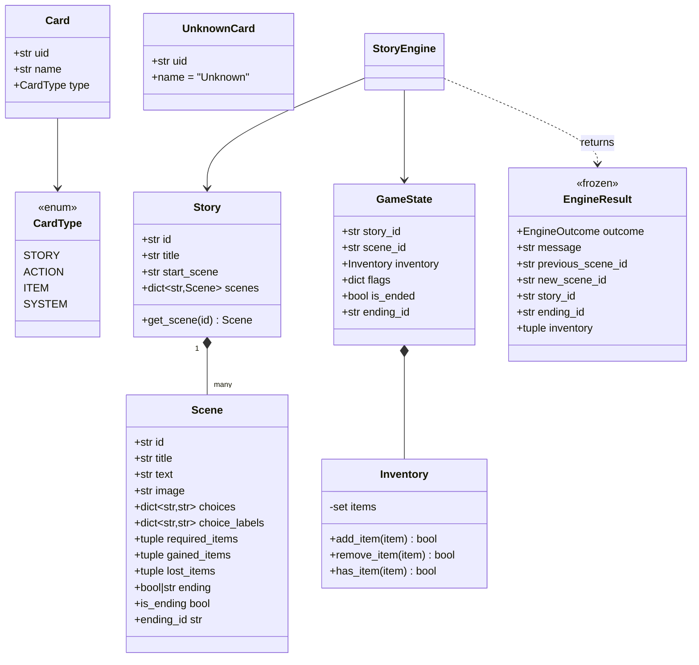
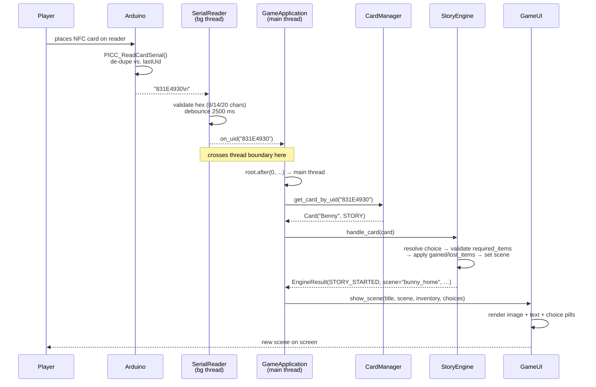
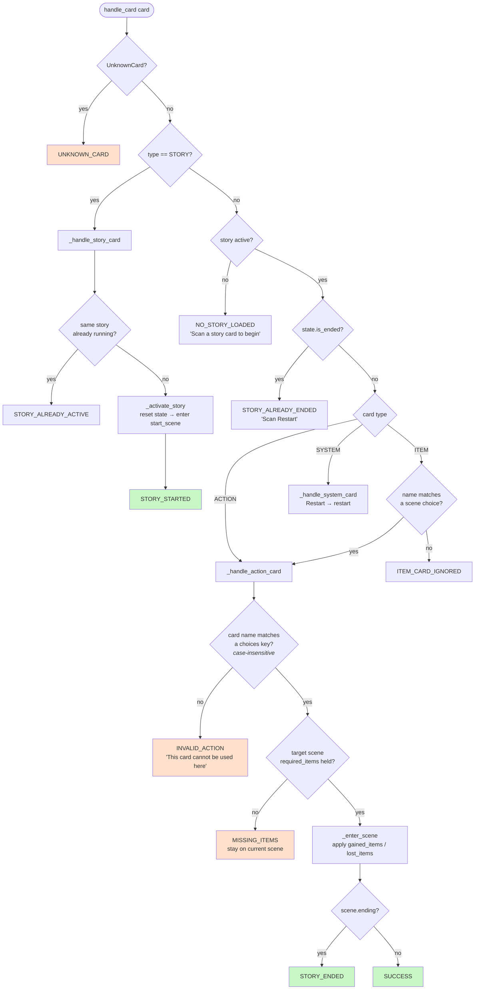

# Architecture (as built) — Tangible NFC Interactive Storybook

**Course:** Natural User Interfaces (HTW, 7th semester)
**Scope:** Describes the system *as it is actually implemented* in the repository, module by module.

> This document reflects the code. The older `docs/ARCHITECTURE.md` is the Step-2 *design* document and has drifted from the implementation — see [§12 Design vs. implementation](#12-design-vs-implementation).

---

## 1. What the system is

An **offline tangible storytelling game**. A child advances a branching story by placing **physical NFC cards** on an RC522 reader. There are no gameplay buttons: the card *is* the input device. An Arduino reads the card UID, sends it over USB serial, and a Python application maps that UID to a symbolic card ("Sword", "Talk", "Benny"), feeds it into a story state machine, and renders the resulting scene in a full-screen Tkinter window.

Three properties drive every design decision:

| Property | How it's achieved |
|---|---|
| **Tangible input only** | The UI has no gameplay controls. `ui.py` renders; it never decides. |
| **Fully offline** | Stories are local JSON, images are local PNGs. No network, no AI at runtime. |
| **Content without code** | Adding a story = adding one JSON file. Adding a card = one entry in `data/cards.json`. The engine is content-agnostic. |

---

## 2. Layered architecture

The application is a strict four-layer stack. Each layer only knows about the one below it, and the two layers that touch the outside world (serial, Tkinter) are at the edges — so the core game logic is testable with no hardware and no GUI.



**Key structural rule:** `story_engine.py` and `story_loader.py` import neither `tkinter` nor `serial`. That is why the whole game is playable in a terminal (`--cli`) and why the test suite needs no hardware.

---

## 3. Module responsibilities

### Application modules

| Module | Lines | Responsibility |
|---|---:|---|
| [`main.py`](../main.py) | 781 | **Composition root.** Constructs every module, wires callbacks, owns the app lifecycle. Also contains the `--cli` terminal REPL and the argument parser. Contains no story rules — it only translates `EngineOutcome` values into UI calls. |
| [`serial_reader.py`](../serial_reader.py) | 345 | **Hardware boundary.** Auto-detects the Arduino port, reads UID lines on a daemon thread, validates & debounces them, and reconnects automatically after unplug. |
| [`card_manager.py`](../card_manager.py) | 200 | **UID → Card mapping.** Parses `data/cards.json`, normalises UIDs (uppercase, no spaces), returns `Card` or `UnknownCard`. Invalid entries are skipped with a warning, never crash startup. |
| [`story_loader.py`](../story_loader.py) | 538 | **Content ingestion + validation.** Parses story JSON into immutable `Story`/`Scene` objects, validates structure (including that every choice targets an existing scene), and caches by story ID. |
| [`story_engine.py`](../story_engine.py) | 581 | **The game.** Branching state machine: active story, current scene, inventory, ending state. Every scan enters here and leaves as a typed `EngineResult`. |
| [`ui.py`](../ui.py) | 1079 | **Presentation only.** Three screens (start / scene / ending) in a full-screen bright pastel theme, plus a persistent footer and an optional debug panel. |
| [`asset_manager.py`](../asset_manager.py) | 180 | **Image loading + caching.** Resolves paths relative to the project root, scales with aspect ratio preserved, and generates a themed placeholder when a PNG is missing — so a bad path never crashes the UI. |

### Developer tooling (not part of the runtime)

| Script | Purpose |
|---|---|
| [`register_cards.py`](../register_cards.py) | Interactive enrolment: scan a physical card, type its name and type, and it's written into `data/cards.json`. This is how the UIDs in the registry were obtained. |
| [`audit_stories.py`](../audit_stories.py) | Story QA: walks every scene graph, reports unreachable scenes, broken links, dead ends, and choices that use action names outside the physical card set. Exits non-zero on structural errors — usable as a pre-commit / CI gate. |
| [`generate_placeholders.py`](../generate_placeholders.py) | Scans all story JSON for `image` paths and generates placeholder PNGs for any that don't exist yet, so writing content isn't blocked on artwork. |

---

## 4. Data model



`Story`, `Scene`, `Card` and `EngineResult` are **frozen dataclasses** — once loaded, content cannot be mutated by accident at runtime. Only `GameState` and `Inventory` are mutable, and `get_state()` hands out a *copy*, so callers can't reach in and change engine state.

### Card types

| Type | Example | Behaviour |
|---|---|---|
| `story` | Benny, Mina, Nova | Starts a story. Ignored (with a message) if that same story is already running. |
| `action` | Sword, Magic, Shield, Run, Talk, Hide, Open Door | Matched against the current scene's `choices` keys → scene transition. |
| `item` | Key | Normally inert — items are granted *by entering scenes*, not by scanning. But if the current scene has a choice with that name, it is treated as an action (this is why "Key" works as a choice in the stories). |
| `system` | Restart | `Restart` re-enters the current story's start scene with a fresh inventory. |

---

## 5. Runtime flow — a card scan end to end



### The threading contract

This is the single most important correctness detail in the app. `SerialReader` runs its read loop on a **daemon thread**; Tkinter is **not thread-safe**. The bridge is in [`main.py:502`](../main.py):

```python
def _on_uid(self, uid: str) -> None:
    """Serial callback (background thread) — marshal to Tkinter main thread."""
    self._root.after(0, lambda: self._handle_uid(uid))
```

`root.after(0, …)` queues the work onto the Tkinter event loop. **Every** touch of engine state and UI state happens on the main thread; the serial thread only ever hands over a string. The same pattern is used for connection-status changes.

---

## 6. The story engine state machine

`StoryEngine.handle_card()` is the single entry point for all input. Its dispatch:



**Why 11 outcome values instead of a boolean?** `EngineOutcome` is a closed enum, so `main.py` can exhaustively map each outcome to exactly one UI reaction (error toast, status message, screen switch) — and the same mapping is reused by the CLI. The engine never formats a screen; the app never re-derives game rules. That split is what makes both front-ends stay in sync.

### Item gating

Items are **not** picked up by scanning an item card. They are granted on scene *entry* (`gained_items`) and consumed on entry (`lost_items`), and gates are checked on the *target* scene (`required_items`) before the transition commits. If the gate fails, the player stays put and gets a `MISSING_ITEMS` message naming the missing item. This keeps the tangible interaction honest: you can't cheat a locked door by holding the right plastic card, you have to have visited the scene that gives you the key.

---

## 7. Data formats

### `data/cards.json` — the card registry

```json
{
  "831E4930": { "name": "Benny",     "type": "story"  },
  "A3531C34": { "name": "Run",       "type": "action" },
  "55555555": { "name": "Key",       "type": "item"   },
  "99999999": { "name": "Restart",   "type": "system" }
}
```

Keys are uppercase hex UIDs. 12 cards are currently registered: 3 story, 7 action, 1 item, 1 system. UIDs beginning `1111…`/`2222…` are placeholders awaiting physical enrolment via `register_cards.py`; `831E4930`, `B3133334`, `C1D2E3F4`, `A3531C34` are real tags.

### `stories/*.json` — a scene

```json
{
  "id": "bunny_home",
  "title": "Benny's Morning",
  "text": "Benny the little rabbit wakes up under the old oak tree…",
  "image": "assets/images/fantasy/bunny_home.png",
  "choices":       { "Talk": "grandma_rabbit", "Run": "forest_path", "Key": "locked_box" },
  "choice_labels": { "Talk": "💬 Talk — Ask Grandma Rabbit for help" },
  "required_items": [],
  "gained_items": [],
  "lost_items": [],
  "ending": false
}
```

- `choices` maps a **physical card name** to a target scene ID. This is the contract between the cardboard and the content.
- `choice_labels` is **display-only** — the UI shows the friendly label, the engine matches on the key. This lets the same "Run" card mean "flee the dragon" in one scene and "head into the forest" in another without touching engine code.
- `ending` may be `false`, `true`, or a string ending ID (e.g. `"victory"`), which the ending screen displays.

### Current content

| Story | ID | Scenes | Endings | Action cards used |
|---|---|---:|---:|---|
| Benny and the Lost Crystal | `benny` | 29 | 3 | Talk, Run, Key, Magic, Shield, Sword, Hide, Open Door |
| Mina and the Missing Moon Lantern | `mina` | 21 | 2 | Talk, Run, Key, Magic, Sword, Hide, Open Door |
| Nova and the Friendly Star | `nova` | 25 | 3 | Talk, Run, Key, Magic, Shield, Open Door |

75 scenes and 8 endings total, all reachable with the same 12-card physical deck.

---

## 8. Presentation layer

`GameUI` owns three stacked `tk.Frame` screens, raised via `tkraise()` — no widget rebuilding on transitions:

```
┌─────────────────────────────────────────────────────────┐
│  _StartScreen   │  _StorySceneScreen  │  _EndingScreen  │  ← one visible at a time
│  story cards    │  image + text +     │  ending text +  │
│  to scan        │  choice pills +     │  "scan Restart" │
│                 │  inventory strip    │                 │
├─────────────────────────────────────────────────────────┤
│ 🟢 Reader connected │ Waiting for your NFC card… │ Last scan: Run (A3531C34) │  ← persistent footer
├─────────────────────────────────────────────────────────┤
│ Debug — simulate scan (keys 1–9, 0, -, =)               │  ← only when --debug
└─────────────────────────────────────────────────────────┘
```

The footer is always visible and answers the three questions a tangible interface must answer continuously: *is the hardware alive*, *what should I do now*, *did my last scan register*. That last-scan readout is the main affordance substitute for the missing click feedback.

Design choices worth noting for the NUI writeup:
- **Full-screen, bright pastel palette, large type** — the display is a shared surface on a table, not a personal screen.
- **Choices are rendered as coloured pills that mirror the physical cards** (same emoji, same colour per action), so the mapping from screen to cardboard is visual, not textual.
- **Errors are transient status-bar messages** (4 s auto-restore), never modal dialogs — a modal would need a click to dismiss, which the interaction model doesn't have.
- **Missing artwork degrades to a themed placeholder** instead of an exception, so an unfinished asset never interrupts a demo.

---

## 9. Operating modes

| Command | Serial | Tkinter | Use |
|---|---|---|---|
| `python main.py` | ✅ | ✅ | Normal operation with the Arduino. |
| `python main.py --debug` | ❌ | ✅ | Full GUI, scans simulated from the debug panel or by clicking choices. Development without hardware. |
| `python main.py --debug --cli` | ❌ | ❌ | Terminal REPL: type a card name to simulate a scan. Useful for content testing and on machines without a working Tk. |

`--debug` forces `hardware_mode = False`, which is why the debug panel and click-to-choose only exist in that mode — in hardware mode the UI is strictly display-only, as the concept requires.

---

## 10. Error handling & resilience

The system is built to survive a live demo. Every external input is treated as untrusted:

| Failure | Handling |
|---|---|
| Arduino unplugged mid-game | `SerialReader` detects the read error, flips to disconnected, and retries every 3 s. Footer turns red; game state is preserved. |
| No Arduino at startup | App still launches, logs a warning, shows "No NFC reader detected", and keeps retrying in the background. |
| Unregistered card scanned | `UnknownCard` → `UNKNOWN_CARD` outcome → "Unknown card scanned." No crash. |
| Malformed `cards.json` | Parse errors logged; app starts with an on-screen error banner rather than dying. Invalid *entries* are skipped individually. |
| Malformed story JSON | `StoryValidationError` with file/scene/field context; that story is skipped, others still load. |
| Choice pointing at a non-existent scene | Rejected at **load** time by `_validate_choice_targets`, not at play time. |
| Missing image | Generated placeholder with the story name. |
| Duplicate/bouncing scans | Two-stage debounce: the Arduino suppresses repeats while the card stays on the reader, and `SerialReader` enforces a 2500 ms window per UID. |

---

## 11. Testing

7 test modules, ~1400 lines, all hardware-free (`tests/conftest.py` builds a synthetic 4-card registry and a small test story in a `tmp_path`):

| File | Covers |
|---|---|
| `test_story_engine.py` | Card dispatch, transitions, restart, ending detection, item gating |
| `test_story_loader.py` | JSON parsing, validation errors, caching, list/dict scene formats |
| `test_story_paths.py` | Walks the *real* stories end-to-end — reachability and completability |
| `test_card_manager.py` | UID normalisation, unknown cards, malformed entries |
| `test_inventory.py` | Add/remove/query/duplicate prevention |
| `test_main_cli.py` | The CLI REPL against scripted input |
| `test_asset_manager.py` | Path resolution, caching, placeholder fallback |

Run with `python -m pytest` (pytest is in `requirements.txt` but was **not installed** in the environment where this document was written, so the suite was not executed here — the coverage above is read from the test sources, not from a green run).

---

## 12. Design vs. implementation

The older `docs/ARCHITECTURE.md` describes the Step-2 plan. Where it disagrees with the code, the code is:

| Design doc says | Reality |
|---|---|
| `inventory_manager.py`, `save_manager.py` as separate modules | Never built as separate files. `Inventory` lives inside `story_engine.py`; **there is no save/resume feature** — no `saves/`, no persistence. Each session starts fresh. |
| Arduino at 9600 baud | 115200 baud (firmware and `SerialReader` agree; only the doc is wrong). |
| `asset_manager.py` not mentioned | Exists and is a real module. |
| `StoryEngine` notifies UI via `on_state_change` observer | Not implemented that way. The engine is **pull-based**: it returns an `EngineResult`, and `main.py` decides what to render. Simpler, and it's what makes the CLI front-end possible. |
| "Implementation not started" | ~4400 lines of application code, 3 stories, 75 scenes. |

### Two things in the code worth fixing

1. **Hard-coded serial port.** [`main.py:469`](../main.py) passes `port="/dev/cu.usbmodem145101"`, a macOS device path. This *bypasses* the `find_arduino_port()` auto-detection that `serial_reader.py` implements, so hardware mode cannot connect on Windows or Linux at all. Passing `port=None` would restore cross-platform auto-detection. (Note also the inconsistent indentation in that block, and in `_handle_card_scan` at `main.py:574`.)
2. **No `SerialReader.stop()` on shutdown.** `_on_close` calls `disconnect()` but not `stop()`, so `_running` stays `True` and the listener thread keeps trying to reconnect until the process exits. Harmless in practice (it's a daemon thread) but `stop()` is the intended call.

---

## 13. Extending the system

**Add a story** — drop `stories/newstory.json` in place, add a `story`-type card to `data/cards.json`, add its ID to `STORY_CARD_TO_ID` in `story_engine.py:21`, then run `python audit_stories.py` to verify the graph. No engine changes.

**Add an action card** — enrol the physical tag with `python register_cards.py`, then use its name as a `choices` key in any scene. The engine resolves choices by name at runtime, so no code change is needed; add it to `VALID_NFC_ACTIONS` in `audit_stories.py` so the auditor recognises it.

**Add a new front-end** — implement anything that can call `StoryEngine.handle_card()` and branch on `EngineOutcome`. The CLI mode in `main.py` is the worked example, in ~150 lines.
