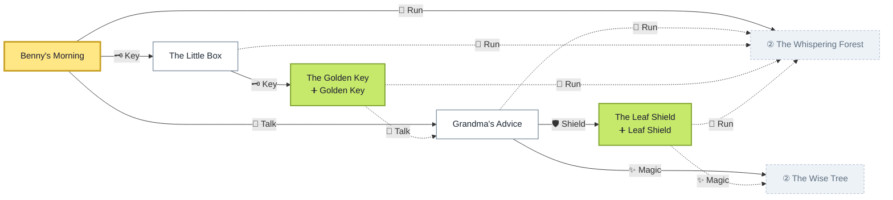
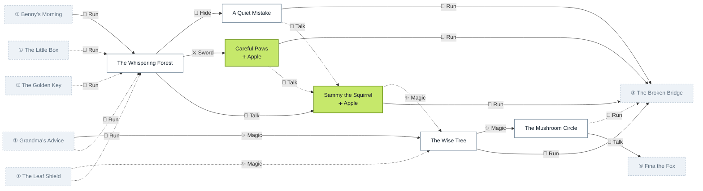
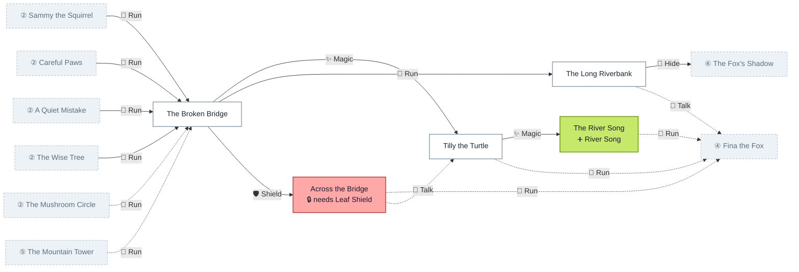
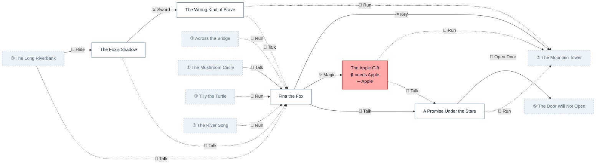
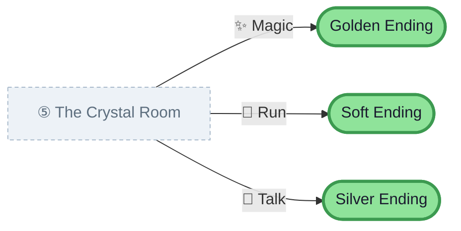

# Story map — Benny and the Lost Crystal

*Generated by `generate_story_map.py`. Re-run it after editing the story.*

| | |
|---|---|
| Scenes | 29 |
| Card transitions | 60 |
| Endings | 3 |
| Item gates | 4 (Apple, Golden Key, Leaf Shield, River Song) |
| Shortest route to an ending | 8 scans |
| Deepest scene | 8 scans from the start |

**Legend** — 🟡 start · 🟢 ending · 🔴 needs an item to enter · 🟩 gives an item.

Arrow labels are the NFC card you place on the reader. **Solid arrows** carry the story forward; **dotted arrows** loop back or sideways to a scene the child could already reach, so the forward path stays readable.

```mermaid
flowchart LR
    subgraph act0["1 · At Home"]
        direction TB
        bunny_home["Benny's Morning"]
        grandma_rabbit["Grandma's Advice"]
        locked_box["The Little Box"]
        golden_key["The Golden Key<br/>➕ Golden Key"]
        take_leaf_shield["The Leaf Shield<br/>➕ Leaf Shield"]
    end
    subgraph act1["2 · The Forest"]
        direction TB
        forest_path["The Whispering Forest"]
        squirrel_help["Sammy the Squirrel<br/>➕ Apple"]
        cut_thorns["Careful Paws<br/>➕ Apple"]
        ignore_squirrel["A Quiet Mistake"]
        wise_tree["The Wise Tree"]
        glowing_mushrooms["The Mushroom Circle"]
    end
    subgraph act2["3 · The River"]
        direction TB
        broken_bridge["The Broken Bridge"]
        cross_bridge["Across the Bridge<br/>🔒 needs Leaf Shield"]
        river_turtle["Tilly the Turtle"]
        riverbank["The Long Riverbank"]
        water_song["The River Song<br/>➕ River Song"]
    end
    subgraph act3["4 · Fina the Fox"]
        direction TB
        fox_shadow["The Fox's Shadow"]
        scare_fox["The Wrong Kind of Brave"]
        fox_meeting["Fina the Fox"]
        heal_sister["The Apple Gift<br/>🔒 needs Apple<br/>➖ Apple"]
        crystal_promise["A Promise Under the Stars"]
    end
    subgraph act4["5 · The Tower"]
        direction TB
        mountain_tower["The Mountain Tower"]
        locked_tower_fail["The Door Will Not Open"]
        vine_lift["The Helpful Vines<br/>🔒 needs River Song"]
        tower_gate["The Golden Door<br/>🔒 needs Golden Key"]
        crystal_room["The Crystal Room"]
    end
    subgraph act5["6 · Endings"]
        direction TB
        golden_ending(["Golden Ending"])
        silver_ending(["Silver Ending"])
        lost_ending(["Soft Ending"])
    end

    bunny_home -->|"🗝️ Key"| locked_box
    bunny_home -->|"🏃 Run"| forest_path
    bunny_home -->|"💬 Talk"| grandma_rabbit
    grandma_rabbit -->|"✨ Magic"| wise_tree
    grandma_rabbit -.->|"🏃 Run"| forest_path
    grandma_rabbit -->|"🛡️ Shield"| take_leaf_shield
    locked_box -->|"🗝️ Key"| golden_key
    locked_box -.->|"🏃 Run"| forest_path
    golden_key -.->|"🏃 Run"| forest_path
    golden_key -.->|"💬 Talk"| grandma_rabbit
    take_leaf_shield -.->|"✨ Magic"| wise_tree
    take_leaf_shield -.->|"🏃 Run"| forest_path
    forest_path -->|"🙈 Hide"| ignore_squirrel
    forest_path -->|"⚔️ Sword"| cut_thorns
    forest_path -->|"💬 Talk"| squirrel_help
    squirrel_help -.->|"✨ Magic"| wise_tree
    squirrel_help -->|"🏃 Run"| broken_bridge
    cut_thorns -->|"🏃 Run"| broken_bridge
    cut_thorns -.->|"💬 Talk"| squirrel_help
    ignore_squirrel -->|"🏃 Run"| broken_bridge
    ignore_squirrel -.->|"💬 Talk"| squirrel_help
    wise_tree -->|"✨ Magic"| glowing_mushrooms
    wise_tree -->|"🏃 Run"| broken_bridge
    glowing_mushrooms -.->|"🏃 Run"| broken_bridge
    glowing_mushrooms -->|"💬 Talk"| fox_meeting
    broken_bridge -->|"✨ Magic"| river_turtle
    broken_bridge -->|"🏃 Run"| riverbank
    broken_bridge -->|"🛡️ Shield"| cross_bridge
    cross_bridge -.->|"🏃 Run"| fox_meeting
    cross_bridge -.->|"💬 Talk"| river_turtle
    river_turtle -->|"✨ Magic"| water_song
    river_turtle -.->|"🏃 Run"| fox_meeting
    riverbank -->|"🙈 Hide"| fox_shadow
    riverbank -.->|"💬 Talk"| fox_meeting
    water_song -.->|"🏃 Run"| fox_meeting
    fox_shadow -->|"⚔️ Sword"| scare_fox
    fox_shadow -.->|"💬 Talk"| fox_meeting
    scare_fox -.->|"🏃 Run"| mountain_tower
    scare_fox -.->|"💬 Talk"| fox_meeting
    fox_meeting -->|"🗝️ Key"| mountain_tower
    fox_meeting -->|"✨ Magic"| heal_sister
    fox_meeting -->|"💬 Talk"| crystal_promise
    heal_sister -.->|"🏃 Run"| mountain_tower
    heal_sister -.->|"💬 Talk"| crystal_promise
    crystal_promise -->|"🚪 Open Door"| locked_tower_fail
    crystal_promise -.->|"🏃 Run"| mountain_tower
    mountain_tower -->|"🗝️ Key"| tower_gate
    mountain_tower -->|"✨ Magic"| vine_lift
    mountain_tower -->|"🚪 Open Door"| locked_tower_fail
    mountain_tower -.->|"🏃 Run"| broken_bridge
    locked_tower_fail -.->|"🗝️ Key"| tower_gate
    locked_tower_fail -.->|"✨ Magic"| vine_lift
    locked_tower_fail -.->|"🏃 Run"| mountain_tower
    vine_lift -.->|"🗝️ Key"| tower_gate
    vine_lift -->|"🚪 Open Door"| crystal_room
    tower_gate -->|"🚪 Open Door"| crystal_room
    tower_gate -->|"💬 Talk"| crystal_room
    crystal_room -->|"✨ Magic"| golden_ending
    crystal_room -->|"🏃 Run"| lost_ending
    crystal_room -->|"💬 Talk"| silver_ending

    classDef scene fill:#FFFFFF,stroke:#8496A6,stroke-width:1.5px,color:#1B2733
    class grandma_rabbit,locked_box,forest_path,ignore_squirrel,wise_tree,glowing_mushrooms,broken_bridge,river_turtle,riverbank,fox_shadow,scare_fox,fox_meeting,crystal_promise,mountain_tower,locked_tower_fail,crystal_room scene
    classDef start fill:#FFE785,stroke:#C9A227,stroke-width:3px,color:#1A1A2E
    classDef ending fill:#8FE39A,stroke:#3C9A50,stroke-width:3px,color:#1A1A2E
    classDef gate fill:#FFA8A8,stroke:#C25454,stroke-width:2px,color:#1A1A2E
    classDef giver fill:#C6E86B,stroke:#7FA32E,stroke-width:2px,color:#1A1A2E
    class bunny_home start
    class golden_ending,silver_ending,lost_ending ending
    class cross_bridge,heal_sister,vine_lift,tower_gate gate
    class golden_key,take_leaf_shield,squirrel_help,cut_thorns,water_song giver
```



> **Caveat on this whole-story view.** Mermaid clips edges where they cross an act
> boundary, so a cross-act arrow visually ends on the act rectangle rather than on the
> scene it points at. The per-act diagrams below have no act boxes, so every arrow
> attaches to a real scene. Use those when the exact source and target matter.

## Act by act

Dashed grey boxes are scenes in another act, marked with that act's number.

### 1 · At Home



### 2 · The Forest



### 3 · The River



### 4 · Fina the Fox



### 5 · The Tower

```mermaid
flowchart LR
    mountain_tower["The Mountain Tower"]
    locked_tower_fail["The Door Will Not Open"]
    vine_lift["The Helpful Vines<br/>🔒 needs River Song"]
    tower_gate["The Golden Door<br/>🔒 needs Golden Key"]
    crystal_room["The Crystal Room"]
    broken_bridge["③ The Broken Bridge"]
    crystal_promise["④ A Promise Under the Stars"]
    fox_meeting["④ Fina the Fox"]
    golden_ending["⑥ Golden Ending"]
    heal_sister["④ The Apple Gift"]
    lost_ending["⑥ Soft Ending"]
    scare_fox["④ The Wrong Kind of Brave"]
    silver_ending["⑥ Silver Ending"]

    scare_fox -.->|"🏃 Run"| mountain_tower
    fox_meeting -->|"🗝️ Key"| mountain_tower
    heal_sister -.->|"🏃 Run"| mountain_tower
    crystal_promise -->|"🚪 Open Door"| locked_tower_fail
    crystal_promise -.->|"🏃 Run"| mountain_tower
    mountain_tower -->|"🗝️ Key"| tower_gate
    mountain_tower -->|"✨ Magic"| vine_lift
    mountain_tower -->|"🚪 Open Door"| locked_tower_fail
    mountain_tower -.->|"🏃 Run"| broken_bridge
    locked_tower_fail -.->|"🗝️ Key"| tower_gate
    locked_tower_fail -.->|"✨ Magic"| vine_lift
    locked_tower_fail -.->|"🏃 Run"| mountain_tower
    vine_lift -.->|"🗝️ Key"| tower_gate
    vine_lift -->|"🚪 Open Door"| crystal_room
    tower_gate -->|"🚪 Open Door"| crystal_room
    tower_gate -->|"💬 Talk"| crystal_room
    crystal_room -->|"✨ Magic"| golden_ending
    crystal_room -->|"🏃 Run"| lost_ending
    crystal_room -->|"💬 Talk"| silver_ending

    classDef scene fill:#FFFFFF,stroke:#8496A6,stroke-width:1.5px,color:#1B2733
    classDef ghost fill:#EDF2F7,stroke:#A9BACB,stroke-width:1px,stroke-dasharray:4 3,color:#5D6E7E
    classDef start fill:#FFE785,stroke:#C9A227,stroke-width:3px,color:#1A1A2E
    classDef ending fill:#8FE39A,stroke:#3C9A50,stroke-width:3px,color:#1A1A2E
    classDef gate fill:#FFA8A8,stroke:#C25454,stroke-width:2px,color:#1A1A2E
    classDef giver fill:#C6E86B,stroke:#7FA32E,stroke-width:2px,color:#1A1A2E
    class mountain_tower,locked_tower_fail,crystal_room scene
    class broken_bridge,crystal_promise,fox_meeting,golden_ending,heal_sister,lost_ending,scare_fox,silver_ending ghost
    class vine_lift,tower_gate gate
```



### 6 · Endings



## Re-rendering the image

The PNG/SVG in `docs/img/` are produced with mermaid-cli. After editing the story,
re-run this script, then:

```powershell
cd docs/img
mmdc -i story-map-benny.mmd -o story-map-benny.png -c mermaid-config.json -p puppeteer-config.json -b "#FFFFFF" -w 3600 -s 2
```

`puppeteer-config.json` points at the installed Chrome, because the Chromium that
ships with Puppeteer fails to launch on this machine (`0xC000007B`).
